# MapTileCutter

A small tool to create map tiles.

Origin Author: https://github.com/jeanropke/MapTileCutter

# 说明

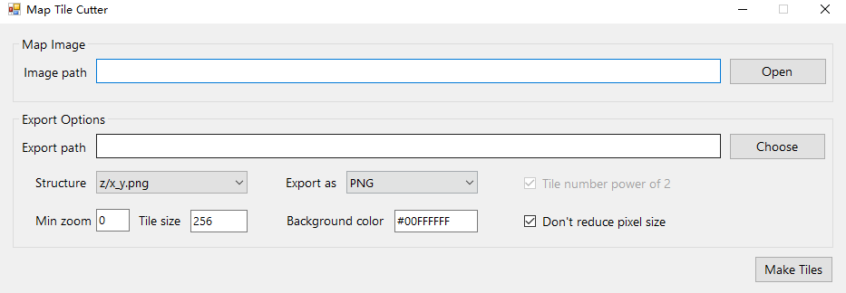

简单小工具，按照 Tile-Map 的要求，切割普通图片为 Tile Map 分层切片，切割结果可直接供 leafletjs 使用。

可以切割长方形、正方形图片，切割时会将长方形用空白补齐为正方形（Tile Map 要求）。

# Demo

长方形测试图（1080 x 1440）：

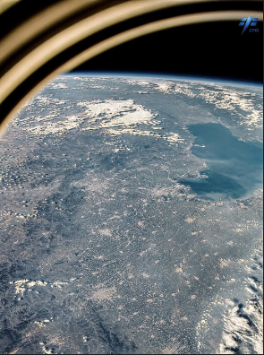

注意，下图 Demo 中的红色(#FF00FFFF)为填充色，仅作示例。

真正使用时填写 #00FFFFFF（Background color(ARGB)）保持透明即可。

## 256 切割，不勾选 Don't reduce pixel size

###  Level 1

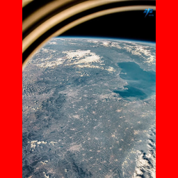

###  Level 2

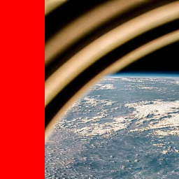
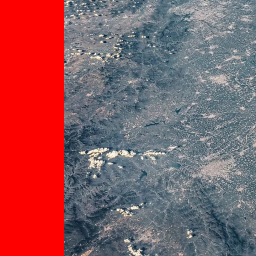
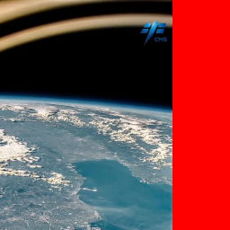
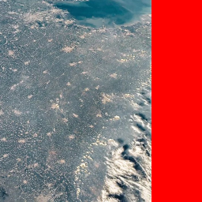

###  其他 Level

见[assets/demo_cut](./assets/demo_cut)。

## 256 切割，勾选 Don't reduce pixel size：

### Level 1

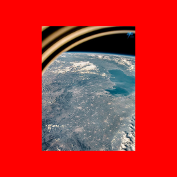

### Level 2

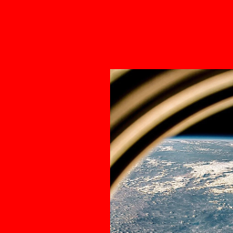
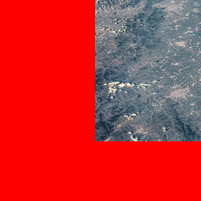
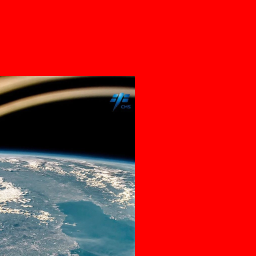
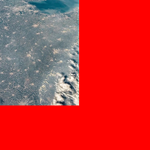

### 其他 Level

见[assets/demo_cut_dont_reduce](./assets/demo_cut_dont_reduce)。

## 切割 Level 计算方法

```csharp
level = floor(log(min(max(width,height),bitmapMaxLimit)) / tileSize,2)
```

由于 Tile-Map 要求切割时 1 切 4（每一层切割数为上一层的 4 倍），即：

|Level|Number of Tile|
|--|--|
|1|1|
|2|4|
|3|16|
|4|64|

因此会按照图片最大边进行切割，另一条短边将会用空白补充，并保持整张图像居中。

## 不勾选 Don't reduce pixel size

当原图最大边不满足 TileSize * 2^n 倍数时，用于切割的虚拟图将会缩小至最近的 TileSize * 2^n，即 math.floor。

因此，无法对齐时，原图会缩小以对齐 TileSize * 2^2。

## 勾选 Don't reduce pixel size

当最大边不满足 TileSize * 2^n 的倍数时，用于切割的虚拟图将会放大至至最近的 TileSize * 2^n，即 math.ceil。虚拟图图形将会把原图内容拷贝到中心，这样图中就多了一圈用于对齐 TileSize * 2^n 的透明边。

这样做的好处是保证 PixelSize 1:1，不对原图进行缩小，缺点是增加了图片数量与总尺寸大小，周围添加了一圈透明边。
